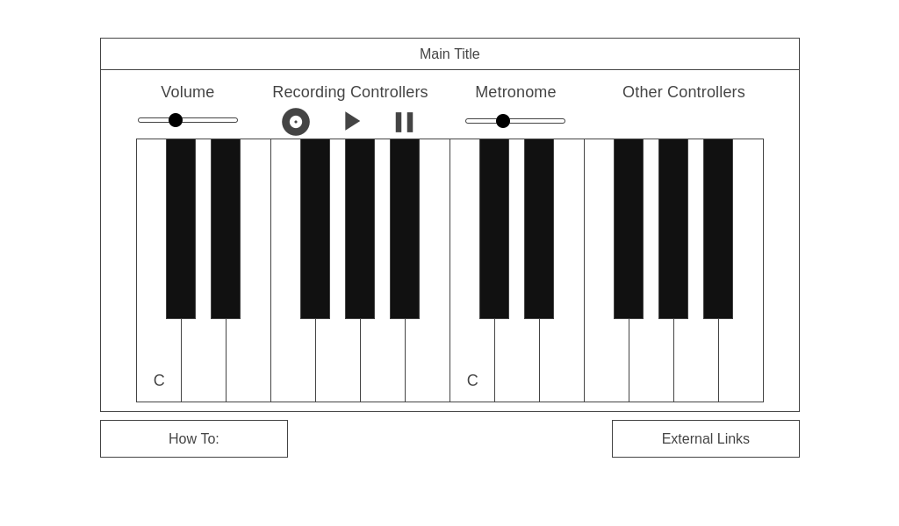

# Online Piano

## Background
I started playing piano when I was five years old so for my Javascript project I will be creating an interactive online keyboard.  The webpage will contain two octaves of a piano and different ways with which to interact.  See below for additional details.

## Functionality & MVPs
In this project, users will be able to:
* Use their mouse or keyboard to play notes
* Record a sequence of notes for the program to play back
* Change the volume of the notes
* Turn on a metronome to help keep pacing
* Toggle on helpers for the user to understand which keystrokes belong to which keys 

In addition, this project will include:
* A **how to** module describing how to interact with the program
* A production README

## Wireframes

* Additional controllers include:
    * Keyboard helpers
    * Sound Options (piano, organ, etc) as bonus
* External links to GitHub, LinkedIn

## Technologies, Libraries, APIs
The project will be implemented using:
* HTML
* CSS
* Canvas
* Webpack
* Library of audio for individual piano notes.  I found `howler.js` as a library frequenty used but want to make sure this would be approved. https://github.com/goldfire/howler.js#documentation

## Implementation Timeline
* **Friday/Weekend**: Setup project foundations so the keyboard shows up on screen and has basic functionality of playing notes through click and keyboard.
* **Monday/Tuesday**: Feature enhancement for recording, volume changes, metronome.  Ensure features are working correctly.
* **Wednesday**: Focus on styling so the layout of all the controllers is as desired and the webpage is appealing to user.
* **Thursday Morning**: Deploy to GitHub.